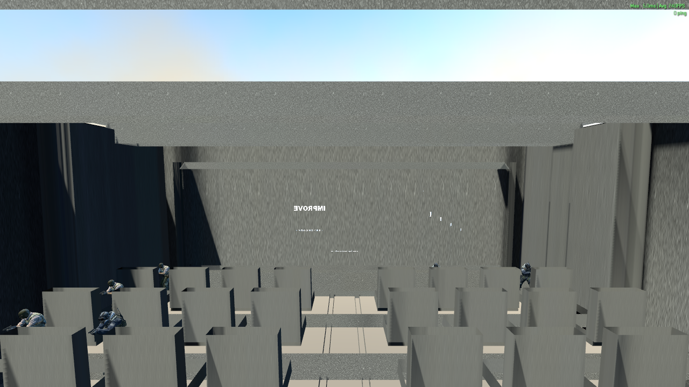
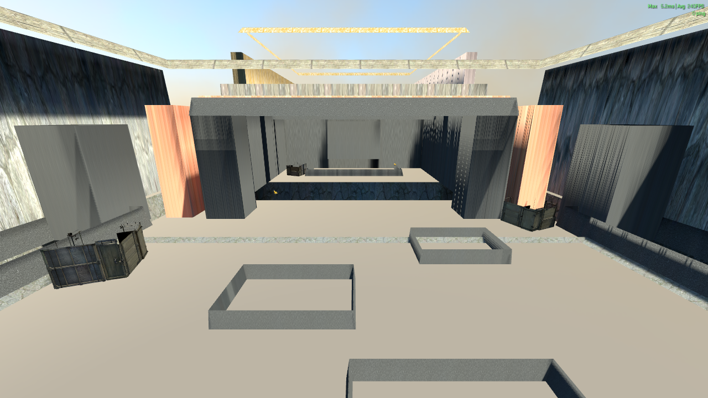
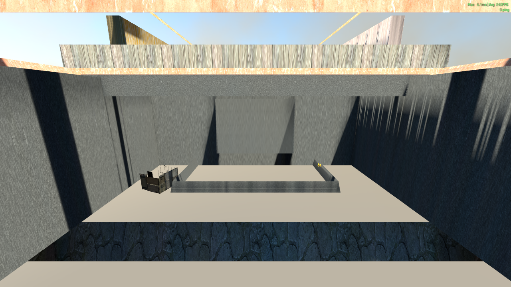
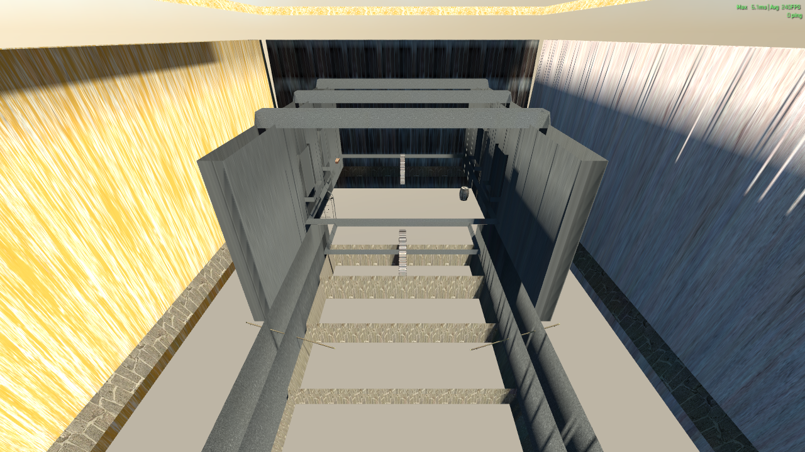
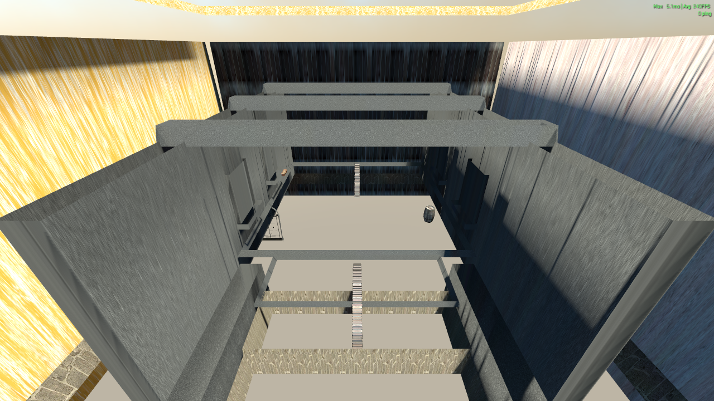

# Benchmark map world sections — runtime review

Review date: 2026-09-12

Branch: `codex/benchmark-map-world-sections-v1`

Map source SHA-256: `74AE13F43EDA0FC213330A30D9714D16B2897710C5409378A9D4BF1294E4BEB6`

Compiled VPK SHA-256: `F950D9ECA4389F9B1BA98C1D62E9AD925A283D28C70EE938FAC89468E4C232C8`

## Method

The installed addon was opened through the Workshop Tools project selector,
then through Hammer's `Run ( Skip Build )` action. This is the first launch
path in this worktree that mounted and ran the compiled map reliably.

One unmodified controller run reached:

```text
[IYBENCH] STATUS phase=complete pass=measured event=60
```

The VConsole search reported no matching `[IYBENCH] ERROR` lines in the
reviewed log. Performance remains `measurement_status=unverified` because no
frame collector was active.

For the world-only images, the runtime `point_script` entity was removed after
the controller run. Each unchanged marker pose was then entered as a free
inspection position. Position and angle were sent first; `screenshot` was sent
after the next rendered frame so the image did not capture the previous pose.
This runtime-only inspection did not alter the VMAP or controller.

## Evidence and findings

### Cinema intro — WORLD NEEDS WORK



SHA-256: `D79741D85EB16EC911F82F887226772EA2D41D0C297B6F6ABE17FDC45C4EFD57`

Free inspection pose: `setpos_exact -4000 -3650 210`,
`setang_exact 4 -90 0`.

- Four raised rows, seats and the screen surround are present. The unchanged
  setup creates ten runtime bots; several of them are visible in this frame.
- The world text is viewed from its reverse side and is mirrored.
- The title and URL are too small at 1280 x 720; the URL is not readable.
- The screen reads as a bright grey panel rather than a dark cinema display.
- The seat backs dominate the view and several bots intersect or sit too low
  relative to them.
- Bots retain weapon poses. No deterministic cheering pose or animation is
  active.
- The automatic boot view can appear while the CS2 loading overlay is still
  closing. The current team-spawn view is inside the audience layout rather
  than the intended rear audience viewpoint.

Required correction: flip the world-text facing direction, increase its world
size, separate the dark display panel from the previous screen plane, refine
seat/back dimensions and stand points, and prototype one stable bot cheering
pose before propagating it. A deterministic player/bot assignment cannot be
proven with the current team-spawn-only arrangement and needs an explicit
runtime design in the later intro/controller task.

### Ancient B water / reflection — WORLD NEEDS WORK



SHA-256: `9D9567450F2CE8B1930BC49468FF41F5FCCE3A1DD958F5DF5B2E2D21FB4C2AE1`

Pose: marker 27, `0 2050 165`, looking at `0 2400 60`.

- Entry pillars, banks, stepping-stone outlines and the deeper temple volume
  are present.
- The broad floor remains flat and pale. It does not read as a water surface
  and has no convincing reflection response.
- The room is overexposed and open above, weakening Ancient's silhouette and
  depth.

Required correction: add or repair a continuous water plane with a proven wet
material, darken the enclosure, close the upper sight gaps visible from the
route and verify reflections in the compiled runtime.

### Ancient B red room — WORLD NEEDS WORK



SHA-256: `A37458F2953E31618C11C2296BB18355C6A074A553DE2CB423239D190E122949`

Pose: marker 38, `0 2720 165`, looking at `0 2980 100`.

- The threshold, recessed central volume, dais, crate and candle details are
  present.
- The intended red plaster is not visually dominant. The room reads grey and
  stage-like, so the Red Room landmark is not recognizable.
- The large pale floor and ceiling gaps flatten the composition.

Required correction: establish a clearly red enclosed chamber around the
unchanged camera corridor, reduce pale surfaces, and verify the material under
the baked lighting rather than relying on material names alone.

### Inferno stairs — WORLD NEEDS WORK



SHA-256: `30668F243D70172D9514B0D17F6D283BB07A59FF7F9D9E8BB89178E2E1AEB590`

Pose: marker 48, `0 3600 560`, looking at `0 4450 20`.

- Stair flights, side stringers, rails and the upper corridor are visible.
- The existing camera is strongly top-down, but free inspection confirms that
  the stair structure exists.
- The surfaces are still very bright and the outer enclosure is exposed,
  reducing the intended Inferno interior read.

Required correction: close the visible outer gaps, improve warm interior
contrast and add a stronger landing/doorway silhouette without changing the
stored marker pose.

### Inferno Apps details — WORLD NEEDS WORK



SHA-256: `7FBDDBC488353A26DEC26D0158FF98C9C28157CFCC70D052E4B31E972A5336DC`

Pose: marker 53, `0 3900 520`, looking at `0 4700 60`.

- Orange/yellow side surfaces, overhead beams, stairs and a barrel are
  present.
- The view still reads as an exposed grey corridor. Windows, sills, arch and
  apartment-room detail do not form a recognizable Apps landmark.

Required correction: strengthen the apartment facade and room layering around
the unchanged corridor, bring documented props into the visible cone, close
the sky gaps and rebalance the lighting/material contrast.

## Decision

Overall status is **PARTIAL**. Compile, deployment, tests and a complete
controller runtime succeeded, and the authored geometry is present. All five
visual acceptance gates remain `WORLD NEEDS WORK`; therefore this branch must
not be reported as a completed world-build PASS.
